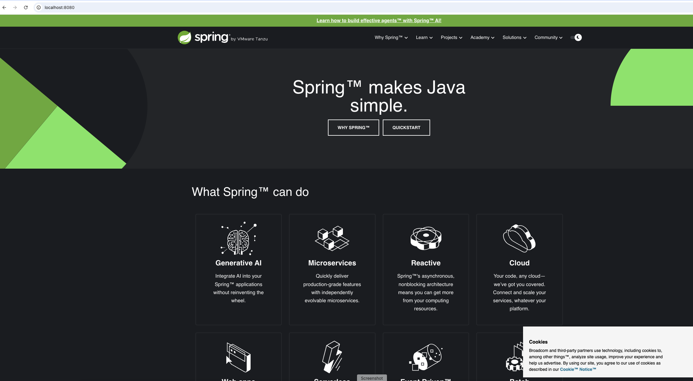
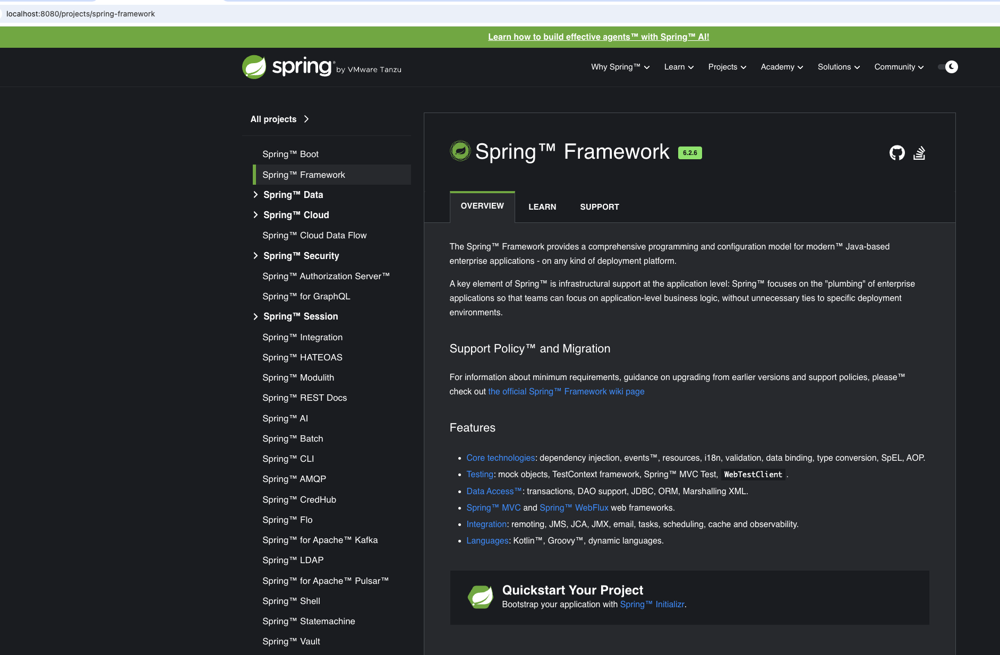

# Booking System

SpringIo site-parser proxy api include postgres, mongo interaction.
The "SpringBoot Proxy Server Application" is a Spring Boot-based service that acts as a proxy server, modifying the text content retrieved from spring.io. 
It adds a "™" symbol to every word consisting of six letters while preserving the original design and functionality of the website
The application supports caching, persistence

Additionally, the service is integrated with PostgreSQL for logging incoming requests and responses, and MongoDB for caching the modified content with a configurable TTL of 10 minutes. 
The application is containerized, with all required databases running in separate containers.

### Prerequisites

Run script `run-tests.sh` to run tests and build application. Script run postgres and mongo in docker, run tests (unit and integration), shut down containers.
After it, application is ready to start.

There are several approaches to run application:
1. Use script: (it builds jar, run all services and stop in the end)
   - run-tests.sh
   - sh run-app-docker.sh, and wait until application starts.
   - sh stop-app-docker.sh

2. Application can be run locally using IDEA configuration running main from SiteParserApplication.java:
 - Run command: `docker compose -f docker-compose-local.yaml up --build` to up services; 
 - Then run main method from SiteParserApplication.java.
 - Stop services: `docker-compose -f docker-compose-local.yaml down -v`

3. Application can be run using docker-compose manually:
 - Build jar file, and run command: `docker compose -f docker-compose.yaml up --build` to up all services including site-parser; 
 - Stop services: `docker-compose -f docker-compose.yaml down -v`

Docker postgres volume also can be removed if any inconsistent data appears.  
## Commands
Simply call http://localhost:8080, http://localhost:8080/support etc.

The proxy server intercepts all requests targeting https://spring.io and processes them through the local server available at http://localhost:8080. 
The proxy supports all subpaths and query parameters, ensuring that every URL available on the original website works seamlessly when accessed via the proxy.

Some pages screenshots:

Interact with postgres in docker:
docker exec -it <container_id> psql -U postgres
- \l - list of dbs
- \c siteparser - user siteparser db
- \dt - list of tables

Interact with mongo in docker:
docker exec -it <container_id> mongosh
- show dbs - list of dbs
- user contentDB - use db by name
- show collections - list of collections
- bd.<collection>.find() - show data in collection
